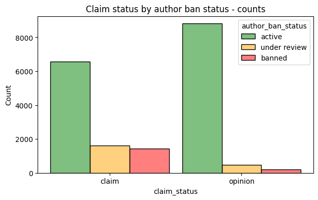
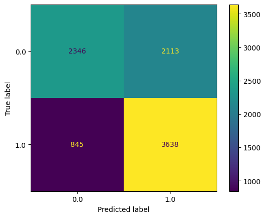

# TikTok Data Analysis: An End-to-End Project

Welcome to the TikTok Data Team's **End-to-End Analysis Project**! This project simulates a real-world scenario where data storytelling and actionable insights drive decision-making. As a Data Analyst on this team, I worked through each stage of the analytical process to solve key challenges and answer pressing research questions.

## Table of Contents
1. [Project Overview](#project-overview)
2. [Exploratory Data Analysis (EDA)](#exploratory-data-analysis-eda)
3. [Hypothesis Testing](#hypothesis-testing)
4. [Regression Modelling](#regression-modelling)
5. [Project Insights](#project-insights)

## Project Overview

The TikTok Data Team is dedicated to understanding the intricate dynamics of user interactions and video characteristics. In this project, our objective is to explore data, test hypotheses, and build predictive models to address two primary challenges:
1. **Distinguishing claim videos from opinion videos.**
2. **Analyzing the relationship between video characteristics and verified user status.**

This project follows three distinct sections:
- **Exploratory Data Analysis (EDA):** Data cleaning, exploration, and visualization.
- **Hypothesis Testing:** Answering critical research questions.
- **Regression Modelling:** Building a machine learning model for prediction.

## Exploratory Data Analysis (EDA)

### Goals
- Explore and understand the dataset, focusing on variables of interest.
- Identify characteristics that distinguish **claim** videos from **opinion** videos.

### Process
1. **Data Cleaning:** Handled missing values and standardized formats.
2. **Data Exploration:** Investigated patterns in user behavior and video characteristics.
3. **Visualizations:** Created charts to uncover insights, such as:
    - Distribution of view counts by video type.
    - Trends between verified status and user engagement.
4. **Evaluated Results:** Shared key takeaways to inform subsequent stages.

📂 [EDA Notebook](TikTok_EDA.ipynb)

## Hypothesis Testing

### Research Questions
1. **Do videos from verified accounts have different average view counts compared to those from unverified accounts?**
2. **Is there a relationship between an account being verified and the view counts of its associated videos?**

### Methods
- Conducted statistical tests to validate or reject hypotheses.
- Compared verified and unverified accounts using average view counts.
- Assessed correlation between verified status and video performance metrics.

📂 [Hypothesis Testing Notebook](AB_Testing.ipynb)

## Regression Modelling (Logistic Regression)

### Objectives
- Develop a logistic regression model to predict **verified user status**.
- Understand the relationship between verified users and their likelihood of posting opinion videos.

### Steps
1. **Feature Engineering:** Created relevant variables based on earlier insights.
2. **Model Building:** Trained a logistic regression model using verified status as the outcome variable.
3. **Results Analysis:** Provided insights to enhance TikTok's ability to prioritize user reports effectively.

📂 [Regression Modelling Notebook](Regression.ipynb)

> **Note:** These results are intended to inform the final predictive model for distinguishing claim videos from opinion videos.

## Project Insights

### Key Findings:
- Verified users are more likely to post **opinion** videos.
- Videos from verified accounts generally have **higher view counts**.
- Logistic regression highlighted several significant predictors for verified user status.

## Recommendations

Based on the insights derived from this analysis, here are actionable recommendations for TikTok:

1. **Prioritize Opinion Content Moderation**
   - Allocate more resources to monitor and review opinion videos posted by verified accounts, as these may influence public discussions and trends.
   - Implement automated tagging of opinion videos from verified users for quicker review by the moderation team.

2. **Boost Verified User Engagement**
   - Develop strategies to further engage verified users since their videos naturally attract higher view counts, enhancing TikTok's overall visibility.
   - Introduce exclusive features or perks for verified users to encourage the production of high-quality opinion content.

3. **Improve Content Recommendation Algorithms**
   - Integrate insights from verified users’ behaviors into TikTok’s recommendation engine to better serve content that resonates with the audience.
   - Adjust algorithms to prioritize high-performing videos from verified accounts, ensuring they reach wider audiences.

4. **Enhance User Verification Strategies**
   - Leverage the predictors identified in the logistic regression to refine the criteria for user verification.
   - Use these insights to identify potential candidates for verification, ensuring consistent growth in verified accounts.

5. **Support Data-Driven Reporting**
   - Provide the insights from this project to TikTok's policy and operations teams, enabling them to design targeted interventions for verified accounts and their content.
   - Use these findings to guide future research into claim vs. opinion video classification, paving the way for the development of more sophisticated machine learning models.

Feel free to reach out if you have any questions or feedback. Happy analyzing! 🙂
